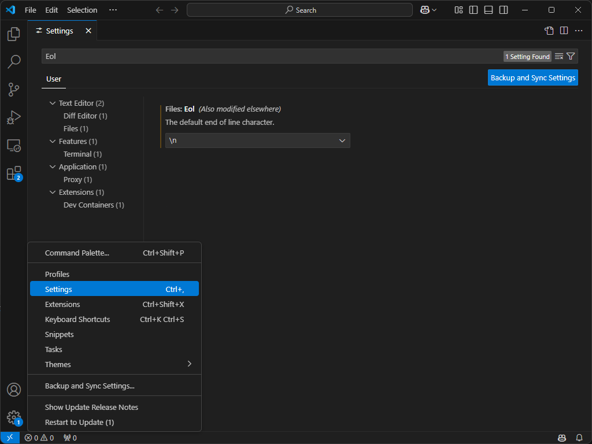

# SMB ROS2 Workspace    

This is the development workspace for Robotics Summer School 2025.

Use devcontainer to open this workspace.

## Installation

```bash
gitman install
```

## Note for Windows Users

Please ensure your editor is configured to use LF (Line Feed) for line endings. You can do this in two ways:

### Method 1: VSCode Settings


### Method 2: Git Configuration
```bash
git config core.autocrlf false 
git rm --cached -r . 
git reset --hard
```

This helps avoid issues when working in cross-platform environments.
